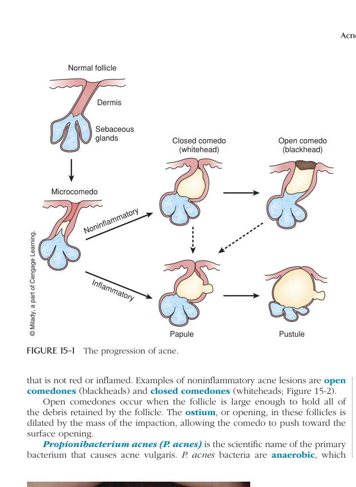

# Chunk 733 - NONINFLAMMATORY AND INFLAMMATORY ACNE LESIONS

**Chunk Index:** 733  
**Source:** skin-care-beyond-the-basics-4th

---

## NONINFLAMMATORY AND INFLAMMATORY ACNE LESIONS

As microcomedones continue to retain more and more dead cells and are coated by more and more sebum, they develop into larger, visible acne lesions. They may become either inflammatory or noninflammatory lesions. Inflammatory acne lesions are inflamed, meaning they are red and swollen lesions. A typical acne pimple is an inflammatory lesion. Noninflammatory refers to an impaction

Acne is a skin condition that results in inflammatory and noninflammatory lesions.

Acne vulgaris is the most common form of acne that is often associated with teenagers.

Hereditary means a trait or condition is inherited from the parents; it is genetic.

Retention hyperkeratosis is the hereditary tendency of dead cells to stick to the sides of the follicle wall.

Oiliness describes a larger-than-normal amount of sebum secreted onto the skin by the sebaceous glands.

Microcomedo is a small impaction formed by cells that have built up on the inside of the follicle wall.

Inflammatory means "swollen and red."

Noninflammatory refers to an impaction that is not red or inflamed.

Acne and the Esthetician 277

Open comedones are noninflammatory acne lesions, usually called blackheads.

Closed comedones are noninflammatory acne lesions, known as whiteheads.

Ostium is the opening in follicles.

Propionibacterium acnes (P. acnes) is the scientific name of the bacteria that cause acne vulgaris.
